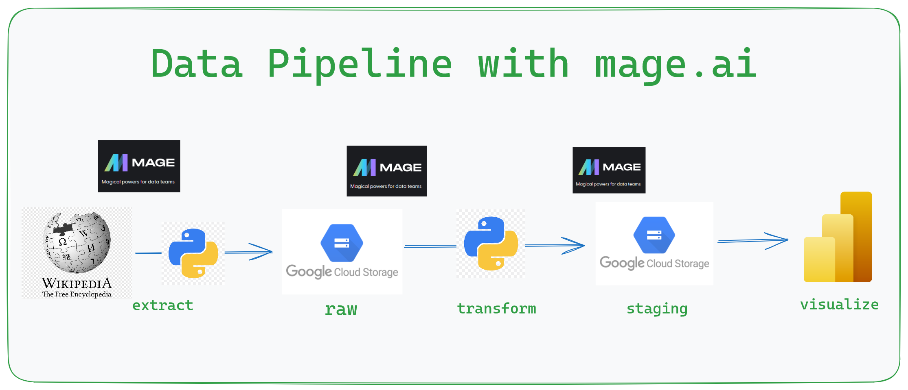

# ETL Data Pipeline Automation with mage.ai

## About

This data project details the usage of how [mage.ai](https://www.mage.ai/) can be used as a tool to aid automation of a data pipeline

Dataset is extracted from a website source which is based on the historical death of hip hop rap artists all over the world.

[Data Source Here](https://en.wikipedia.org/wiki/List_of_murdered_hip_hop_musicians)

 

 

## Data Pipeline
1. Extract data from source url using python
2. Load raw data into Google Cloud Storage data lake
3. Connect to data lake storage and perform transformation on raw data
4. Load transformed data into staging area on Google Cloud Storage
5. Connect Power BI tool to enable visualization and insights

## Using the Project
1. Clone the github repository -> git clone repo-url
2. cd into etl_mage directory `cd etl_mage`
3. Locate the io_config_copy.yaml file and rename to io_config.yaml
4. Inside the io_config.yaml file, locate the GOOGLE_SERVICE_ACCOUNT_KEY section and fill in your Google service account credentials
5. Alternatively, you can give a path to your service account key using the GOOGLE_SERVICE_ACC_KEY_FILEPATH option

## Run the pipeline
1. cd into the `etl_mage` directory
2. type `mage start` in the terminal to start the development environment

## To-Do's
1. Code refactor and optimization
2. Data Visualizationa

## Lesson Learnt
1. Setting up a coding environment using Google cloud compute engine
2. ssh into compute engine instance using vscode 
3. Setting up Google Cloud Service account key
4. Setting up a mage.ai instance and developing its data pipeline
5. Data extraction from a web source using python web scraping tool (BeautifulSoup, requests)
